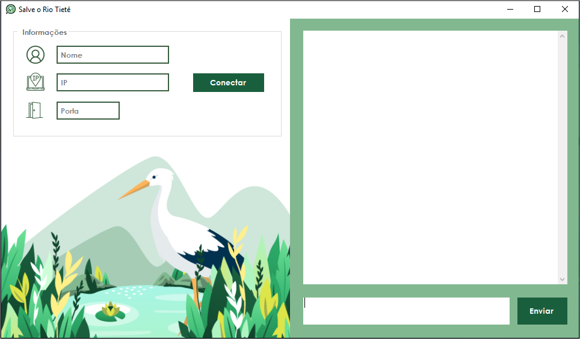
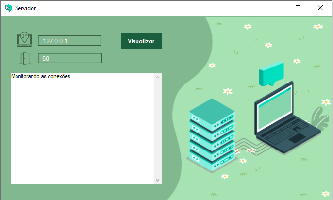

# Chat TCP/IP

## 📚 Sobre

Este projeto é um chat para comunicação de diversos usuários através de uma conexão local utilizando o **protocolo TCP/IP**. Ele foi desenvolvido conjuntamente com meu colega **Luiz Guilherme** e conforme o tema do trabalho da faculdade UNIP do curso de Ciência da Computação, que definia a aplicação para comunicação de servidores públicos responsáveis pelos cuidados do Rio Tiête.   

<h4 align = center> Aplicação do Chat para econexão, envio e recebimento de mensagens. </h4>
<h1>
    
</h1>

<h4 align = center> Aplicação do **Servidor** para monitoramento e armazenamento de mensagens. </h4>
<h1>
    
</h1>

## 💻 Tecnologias utilizadas

- Linguagem C# ;
- Bibliotecas; 
- Visual Studio 2019;

## 🚀 Funcionamento

Para que seja possível a troca de informações, são necessárias duas aplicações: o ‘cliente’ cuja finalidade é se conectar ao servidor para enviar e receber mensagens, e um ‘servidor’ responsável por realizar as conexões e armazena-las em uma ‘hash table’, a qual vai distribuir as mensagens para os usuários.

**Quando for testar:** 

- Abra o aplicativo do servidor no diretório: Chat-TCP-IP\ChatServidor\ChatServidor\bin\Debug\ChatServidor
- Insira o enreço de IP: **127.0.0.1**, resposável pela conexão LAN;
- Insira uma porta, por exemplo: **60**;
- Inicie o servidor; 
- Abra duas vezes a aplicação do Chat no diretório: Chat-TCP-IP\ChatApp\bin\Debug\ChatApp. No caso, será uma aplicação aberta para cada usuário e como vamos testar a comunicação entre duas pessoas, abriremos duas interfaces; 
- Insira um nome de usuário;
- E insira os mesmos valores adicionados anteriormente na aplicação do servidor para o endereço IP e porta;
- E clique em 'Conectar'.

## 🎨 Design

## 📌 Links úteis

___
<h5 align = center>Desenvolvido por Joyce Querubino e Luiz Guilherme Machado Lourenço </h5>

